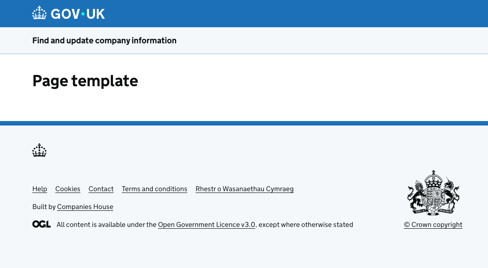

# ch-node-utils

set of node utils which can be used across repos/projects.
Available as a normal npm dependency([here on npmjs](https://www.npmjs.com/package/@companieshouse/ch-node-utils))

## Areas for the different utilities stored in this repo:

### Page template layout

Use this template to keep your pages consistent with the rest of Companies House.

This page template combines the boilerplate markup and components needed for a basic Companies House page. It includes:

- the favicon, and other related theme icons
- the Skip link component, Header component and Footer component
- GOV.UK Frontend CSS and JavaScript for all GOV.UK Design System components

[Read more about how to use the page template layout](./docs/page-template.md#getting-started)




### i18n (Internationalisation)

  Internationalisation has been added to CHS, after already being available (at least for Welsh) on legacy systems (EWF/SCRS/CHD/...)

  The implementation is described in [Confluence](https://companieshouse.atlassian.net/wiki/spaces/OLI/pages/4235231301/Implementing+Internationalisation+on+CH+web+services) for both Java and Node.js services.

  Some common utilities for Node.js are here provided. The chosen Node.js i18n library is [i18next](https://www.i18next.com/), which, at the time of writing, can be considered the standard:

  

  

   - `i18nCh.ts`: wrapper to [i18next](https://www.i18next.com/)

   - `languageNames.ts`: to manage Language names and their associated ISO codes (iso-639). It mainly provides:
      - a function to get, from an array of submitted iso-codes,  a structured array of iso-codes & native names.

     Ex:
     ```
     [... "en", "cy", ...]   ==> [ ... {"IsoCode": "en", "Name": "English" },  {"IsoCode": "cy", "Name": "Cymraeg" } ...]
     ```
      - a custom function to sort the supported locales (apart from leaving 'en' always at 1st position, it sorts alphabetically)

   - `subDirs.ts`: to manage files and dirs, so that i18n locales' folders can be sourced automatically.
      This allows for example to have an array of iso-codes if the `./locales` dir follows the normal convention.
      Ex, this array of iso-codes `[ "ar", "bn", "cy", "de", "en", "gd", "ja", "uk"]` is retrieved from the following tree:
      ```
         │   ├── locales
         │   │   ├── ar
         │   │   │   ├── errors.json
         │   │   │   ├── global.json
         │   │   │   ├── landing.json
         │   │   │   ├── layout.json
         │   │   │   ├── search-company.json
         │   │   │   ├── view-company-information.json
         │   │   │   └── who-to-tell.json
         │   │   ├── bn
         │   │   │   └── *.json
         │   │   ├── cy
         │   │   │   └── *.json
         │   │   ├── de
         │   │   │   └── *.json
         │   │   ├── en
         │   │   │   └── *.json
         │   │   ├── gd
         │   │   │   └── *.json
         │   │   ├── ja
         │   │   │   └── *.json
         │   │   ├── uk
         │   │   │   └── *.json
      ```

   - `manageLocales.middleware.ts`: middleware that can be reused to manage locales while dealing with http requests.

   - `add-lang-to-url.njk`: to add the `lang=xx` query param to urls:
   ```
   https://.....<self>....../?lang=cy
   ```

   

   - `locales-banner.njk`: to add the locales banner

   

   - `ENV VARS`: the following ENV vars are used:

| ENV VAR | Description |
| ------- | ----------- |
|`CH_NODE_UTILS_DROP_LANG_QUERY_PARAM`| It could be set to [drop the lang="xx" query param](https://github.com/companieshouse/ch-node-utils/blob/f9e5c47a86206f0b12e4e536c4c459db16747631/src/middleware/manageLocales.middleware.ts#L25) from the current URL ([see Example](https://github.com/companieshouse/docker-chs-development/blob/842c61245adcbba02a6316847fc4f9d94c52410d/services/modules/dissolution/dissolution-web.docker-compose.yaml#L50)) |
|`CH_NODE_UTILS_LOG_LVL`| It could be set to ["TRACE" or "DEBUG" (case insensitive)](https://github.com/companieshouse/ch-node-utils/blob/24bc717477d21082439d1b460108cb0d60465f0f/src/utils/log.ts#L2) to dump internal info while inside ch-node-utils ([see Example](https://github.com/companieshouse/docker-chs-development/blob/842c61245adcbba02a6316847fc4f9d94c52410d/services/modules/dissolution/dissolution-web.docker-compose.yaml#L49))|

### Menu Navigation Bar

A menu navigation bar component has been added to make it easier to add links pointing to new services when needed. There are two Nunjucks macros: one that adds a menu navigation bar with the provided items and another that adds a menu navigation bar with predefined items. The latter internally uses the former and currently contains links to the following services:

- Authorised agent (conditional)
- Your companies (conditional)
- Your filings
- Companies you follow
- Basket
- Manage account
- Sign out

The "Authorised agent" menu item appears conditionally if the logged user has ACSP membership. The "Your companies" menu items appears conditionally until the service is live.

#### Usage

To use the predefined navbar, import the macro and call it with the required parameters:

```nunjucks


{{ addPredefinedNavbar(userEmailAddress, chsMonitorGuiUrl, lang, displayAuthorisedAgent) }}
```

The macro requires the following parameters:

- `userEmailAddress`: The email address of the logged-in user
- `chsMonitorGuiUrl`: The URL for the "Companies you follow" link
- `lang`: An object containing language-specific strings for localization
- `displayAuthorisedAgent`: A flag for displaying the "Authorised agent" menu item. If the logged user has ACSP membership, this flag should be set to `'yes'`. If your service uses i18 middleware provided in the `@companieshouse/ch-node-utils` package, then this flag will be set to the correct value automatically. If not, you can use `isAuthorisedAgent` function from `./utils/sessionUtils`.
- `displayYourCompanies`: A flag for displaying the "Your companies" menu item. It should be set to `'yes` if this menu iten needs to be displayed.
- `displayUserManagementAdmin`: A flag for displaying the "User management admin" menu item. It should be set to `'yes` if this menu iten needs to be displayed.
- `pageLanguage`: The language code for the page. (e.g. `'en'` or `'cy'`). This allows the language to be kept after navigating to the new service.
- `accountUrl`: base URL to account service - ACCOUNT_URL

#### Localization

The navbar uses translations from `@companieshouse/ch-node-utils` (this) package. To set this up:

1. Ensure the `@companieshouse/ch-node-utils` package is installed. i.e `npm i @companieshouse/ch-node-utils`
2. Update your i18 middleware to load and merge translations from both sources. (`@companieshouse/ch-node-utils/locales`)
3. Add the `@companieshouse/ch-node-utils/templates` directory to the Nunjucks loader paths.

The navbar also requires the use of styles provided in the [ch.gov.uk.css](https://github.com/companieshouse/cdn.ch.gov.uk/blob/master/app/assets/stylesheets/ch.gov.uk.css) stylesheet (you can either add the provided link to the head section or include specific styles in your own stylesheet)

`<link href="{{ cdnHost }}/stylesheets/ch.gov.uk.css" rel="stylesheet"/>`

It also requires the [navbar.js](https://github.com/companieshouse/cdn.ch.gov.uk/blob/master/app/assets/javascripts/lib/navbar.js) script to be added to the footer to make the navbar work in mobile mode (make sure it's the latest version).

`<script src="{{ cdnHost }}/javascripts/lib/navbar.js"></script>`

##### Node.js Version Requirement

This project requires **Node.js version 24 or higher**. Please ensure you are using Node 24+ before installing or running this package.
